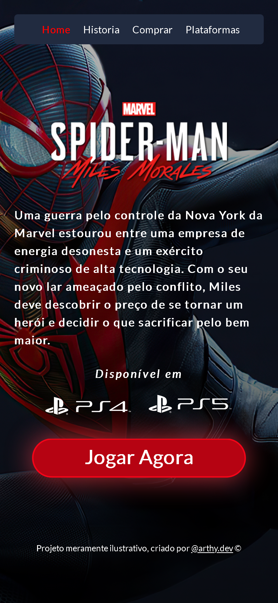

# Spider-Man: Miles Morales Landing Page

Esse projeto foi desenvolvido com o intuito de estudar e colocar em prática conceitos de responsividade , utilizando Flexbox E Media queries.

----------

## Preview

<a href="https://arthydev.github.io/Landing-Page-Marvel-s-Spider-Man-Miles-Morales/" class="btn">Veja Aqui</a>

